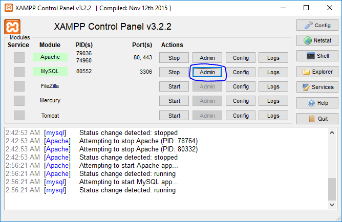

# Online-Shopping-Store
A University project for E-commerce website that has simple 
Login & Register system, 
Profile system,  
CRUD operations for products and users (only admins can delete or edit users), 
Notification system (notify the users if someone bought something from them) 

### -**More about this project [Link](https://drive.google.com/open?id=12pTv_PFgcbE0_IcQAR6IdonmZhLHbMVZ)**

### Prerequisites

[XAMPP](https://www.apachefriends.org/download.html) - The PHP development environment

### Installing

- Download the repository by Clicking on "Clone or Download" Button then Click on Download ZIP
- Install XAMPP
- Start Apache & MySQL By Clicking on Those 2 Buttons
    - 
    - Make sure the start button changed to stop  
- Now you are ready to Import the database 
    - Click on admin button or navigate to http://localhost/phpmyadmin/   
    - We need to create a database inorder to import our database,  
    - Write a name and then click create,  
         
    - You will see your new database on the left hierarchy, click on it  
    - Now we need to import the files to our new database, click on import button 
          Click on choose file then choose the SQL file
         
         Scroll down then click Go button  
- Now your new database should look like this    
- **Now you are ready to explore the site**
